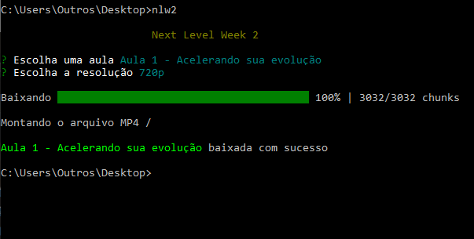

# Next Level Week #2
 
Baixe todos os vídeos da [Next Level Week 2ª Edição](https://nextlevelweek.com/episodios/omnistack/edicao/2)

## Dependências
- [Node.js](https://nodejs.org/)
- [FFMPEG](https://ffmpeg.org/) - Editor de vídeos MP4

## Instalação
Clone esse repositório rodando o seguinte comando no terminal/cmd `git clone https://github.com/rafaeltmbr/nlw2.git`, abra a nova pasta criada e digite `npm install` para baixar todas as dependências dessa aplicação.

Após baixar todas as dependências, instale a apicação globalmente utilizando `npm install -g .`, com isso, será possível rodar a aplicação em qualquer caminho dentro do terminal/cmd.

*Obs.: Não esqueça de instalar o FFMPEG, uma vez que esse é necessário para trabalhar com os vídeos em MP4.*

## Utilização
Abra o terminal/cmd, navegue até o diretório onde deseja salvar a videoaula, execute o comando `nlw2`, escolha a aula e resolução que deseja baixar e divirta-se :D

